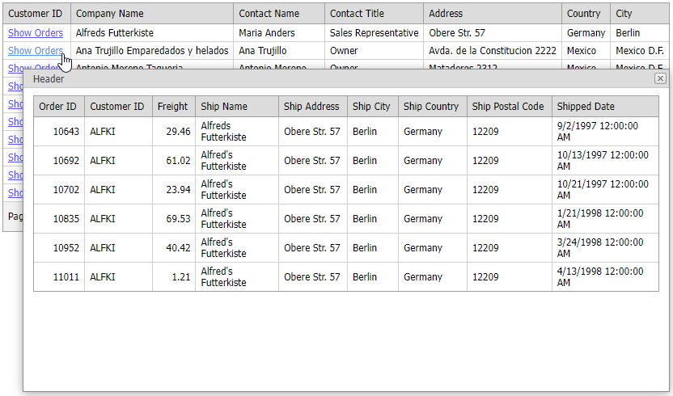

<!-- default badges list -->

[](https://supportcenter.devexpress.com/ticket/details/E20052)
[](https://docs.devexpress.com/GeneralInformation/403183)
[](#does-this-example-address-your-development-requirementsobjectives)
<!-- default badges end -->
# GridView for ASP.NET MVC - How to Open a Popup Window on a Hyperlink Click


This example demonstrates how to open a pop-up dialog when a user clicks a hyperlink in the grid's column.



Define master and detail GridView settings in separate PartialView files: [MasterViewPartial.cshtml](./CS/DisplayDetailInPopupWindow/Views/Shared/MasterViewPartial.cshtml) and [DetailViewPartial.cshtml](./CS/DisplayDetailInPopupWindow/Views/Shared/DetailViewPartial.cshtml).

In the master grid, create a templated column and add a hyperlink to the template. In the hyperlink's `Click` event handler, send a callback to the detail grid.

```xml
// MasterViewPartial.cshtml
@Html.DevExpress().GridView(settings => {
    // ...
    settings.KeyFieldName = "CustomerID";
    settings.Columns.Add(col => {
        col.FieldName = "CustomerID";
        col.SetDataItemTemplateContent(container => {
            Html.DevExpress().HyperLink(hlSettings => {
                // ...
                hlSettings.Properties.ClientSideEvents.Click = string.Format("function(s, e) {{ OnHyperLinkClick('{0}'); }}", (container as GridViewDataItemTemplateContainer).KeyValue.ToString());
                hlSettings.Properties.Text = "Show Orders";
            }).Render();
        });
    });
    // ...
}).Bind(Model).GetHtml()
```

```js
var currentCustomerID;
function OnHyperLinkClick(customerID) {
    currentCustomerID = customerID;
    detailGrid.PerformCallback();
}
```

Handle the client-side [BeginCallback](https://docs.devexpress.com/AspNetMvc/js-MVCxClientGridView.BeginCallback) event of the detail grid. In the handler, declare the `_customerID` property and set it to the current customer ID value. The grid sends this value to the server to filter the detail grid data.

```js
function OnDetailGridBeginCallback(s, e) {
    e.customArgs["_customerID"] = currentCustomerID;
}
```

```xml
// HomeController.cs
public PartialViewResult DetailPartialAction(string _customerID) {
    return PartialView("DetailViewPartial", OrderRepository.GetOrders(_customerID));
}
```

Handle the client-side [EndCallback](https://docs.devexpress.com/AspNet/js-ASPxClientGridView.EndCallback) event of the detail grid to show the Popup control that contains the detail grid with filtered data.

```js
function OnDetailGridEndCallback(s, e) {
    if (!popup.IsVisible()) 
        popup.Show();
}
```

```xml
// Index.cshtml
@Html.DevExpress().PopupControl(settings => {
    // ...
    settings.SetContent(() => {
        Html.RenderPartial("DetailViewPartial", null);
    });
}).GetHtml()

```

## Files to Look At

* [HomeController.cs](./CS/DisplayDetailInPopupWindow/Controllers/HomeController.cs)
* [JSCustom.js](./CS/DisplayDetailInPopupWindow/Scripts/JSCustom.js)
* [Index.cshtml](./CS/DisplayDetailInPopupWindow/Views/Home/Index.cshtml)
* [DetailViewPartial.cshtml](./CS/DisplayDetailInPopupWindow/Views/Shared/DetailViewPartial.cshtml)
* [MasterViewPartial.cshtml](./CS/DisplayDetailInPopupWindow/Views/Shared/MasterViewPartial.cshtml)

## Documentation

- [CallbackRouteValues](https://docs.devexpress.com/AspNetMvc/DevExpress.Web.Mvc.AutoCompleteBoxBaseSettings.CallbackRouteValues)
- [BeginCallback](https://docs.devexpress.com/AspNetMvc/js-MVCxClientGridView.BeginCallback)
- [EndCallback](https://docs.devexpress.com/AspNet/js-ASPxClientGridView.EndCallback)
- [SetContent](https://docs.devexpress.com/AspNetMvc/DevExpress.Web.Mvc.MVCxPopupWindow.SetContent.overloads)

## More Examples

- [Grid View for ASP.NET MVC - How to Use ContentUrl to Display Detail Data within a Popup Window](https://github.com/DevExpress-Examples/how-to-display-detail-data-within-a-popup-window-using-contenturl-mvc-e20051)
- [Grid View for ASP.NET Web Forms - How to Display a Popup Dialog When a User Clicks a Link in a Grid Row](https://github.com/DevExpress-Examples/aspxgridview-display-popup-when-user-clicks-cell-link)
<!-- feedback -->
## Does this example address your development requirements/objectives?

[](https://www.devexpress.com/support/examples/survey.xml?utm_source=github&utm_campaign=asp-net-mvc-grid-open-popup-on-hyperlink-click&~~~was_helpful=yes) [](https://www.devexpress.com/support/examples/survey.xml?utm_source=github&utm_campaign=asp-net-mvc-grid-open-popup-on-hyperlink-click&~~~was_helpful=no)

(you will be redirected to DevExpress.com to submit your response)
<!-- feedback end -->
